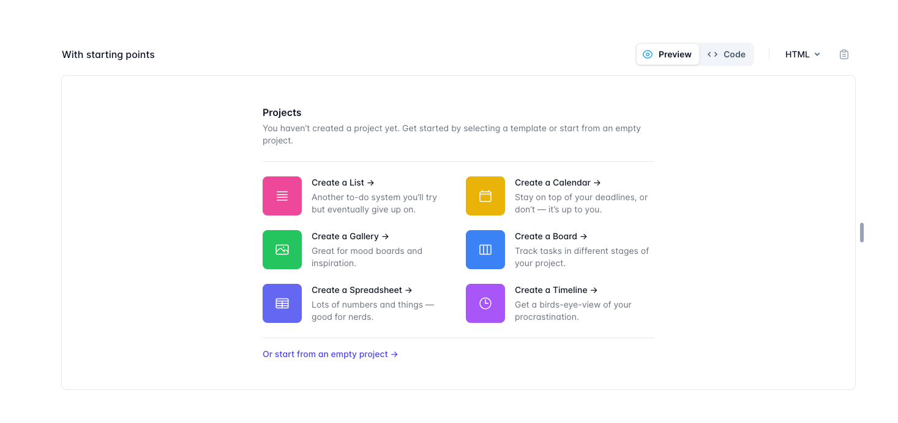
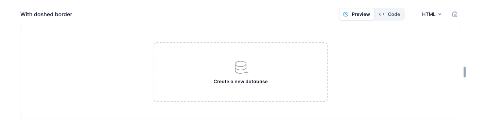
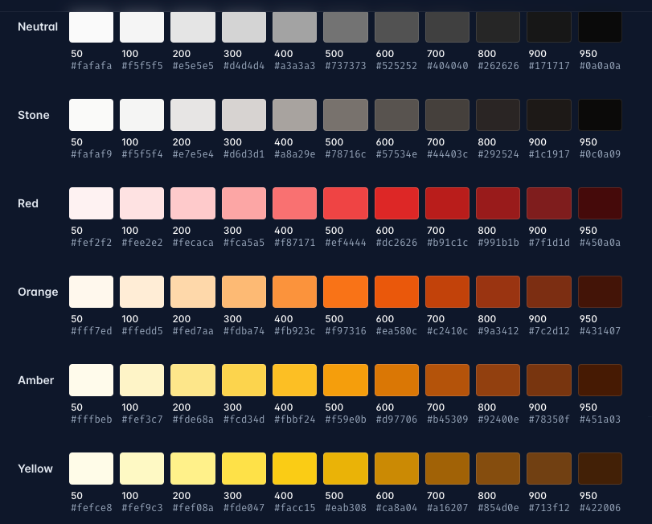
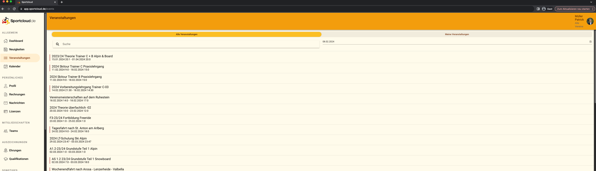

# Start creating a new Page by selecting a template

# Empty page to start selected
### Create a "database"  would be 'add a new row of containers'
Then a popup should come up to select the type of row you want to use. The Rows are predifined with a set 
of components and can't be changed but selected.
In each container of a row you can again select a component to add to the container.

# Colors
### You can use any tailwind color based on this scheme
We currently went with some of the dark orange/brown colors at highlight and stone/neutral as background
https://tailwindcss.com/docs/customizing-colors

### This is a Screenshot of the current Me App

# JSON
### I added all the Json file and renamed it to the current data in our system
Please be aware, that the data is not complete as some references are missing. This is not important to you, you can just work with the data you can use.
# Important, some design decisions werent the best!
## This is why we want to rework the whole CMS design. Therefore many ideas like TemplateId weren't the best. 